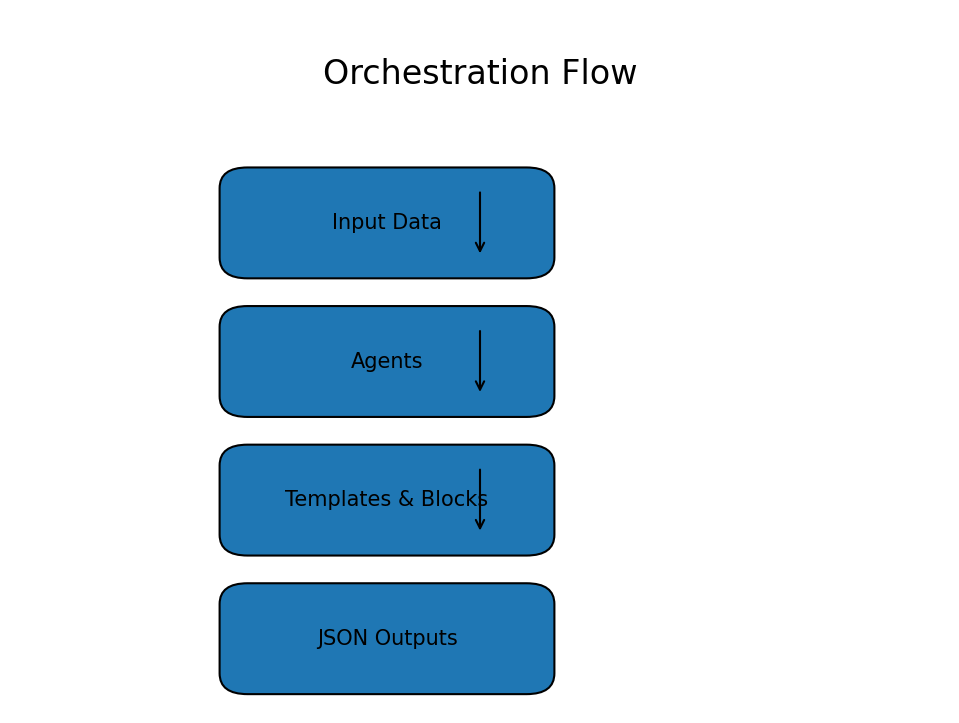

# Kasparro – Applied AI Agentic Content System  
### Author: Shruti Thakkar

## 1. Problem Statement
Build a modular multi-agent system that transforms a small product dataset into structured JSON content pages using templates, reusable logic blocks, and orchestration flows.

## 2. Solution Overview
The system consists of 5 agents that parse data, generate questions, assemble content pages, and perform product comparisons. All outputs are generated as clean JSON, and the workflow is orchestrated through a central pipeline.

## 3. Scopes & Assumptions
- Only the given dataset may be used.
- Product B in comparison is fictional.
- Output must be machine-readable JSON.
- Agents must not share hidden state.

## 4. System Design
### Agents:
1. **DataParsingAgent** – Loads product dataset into internal model.  
2. **QuestionGenerationAgent** – Generates categorized questions.  
3. **FAQAssemblyAgent** – Creates FAQ page from Q&A blocks.  
4. **ProductPageAgent** – Builds product page using template engine.  
5. **ComparisonAgent** – Compares product with fictional Product B.

### Orchestration:
- Defined via a linear pipeline in `Orchestrator`.
- Each agent has clear I/O and single responsibility.

### Logic Blocks:
- Question generation
- Product comparison rules
- Reusable content-construction utilities

### Templates:
- FAQ template  
- Product page template  
- Comparison template  

## 5. System Diagrams & Visualizations

Below are the PNG diagrams representing the system architecture, agent orchestration, logic blocks, and full pipeline.

### 5.1 System Architecture

### 5.2 Orchestration Flow

### 5.3 Single-Responsibility Agent View

### 5.4 Logic Block Interaction Diagram

### 5.5 End-to-End Automation Pipeline

